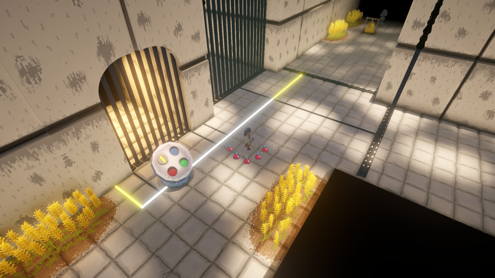
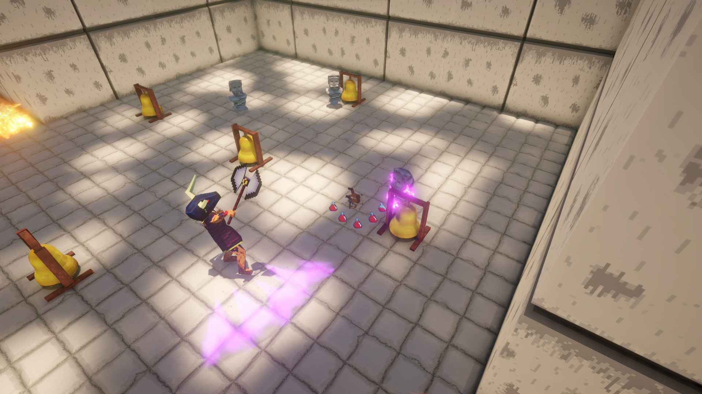
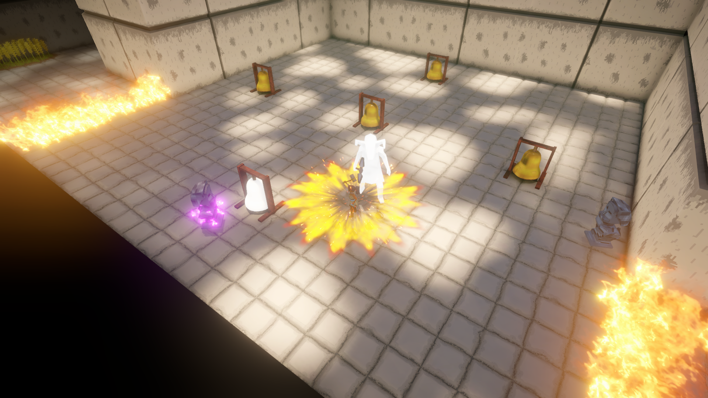
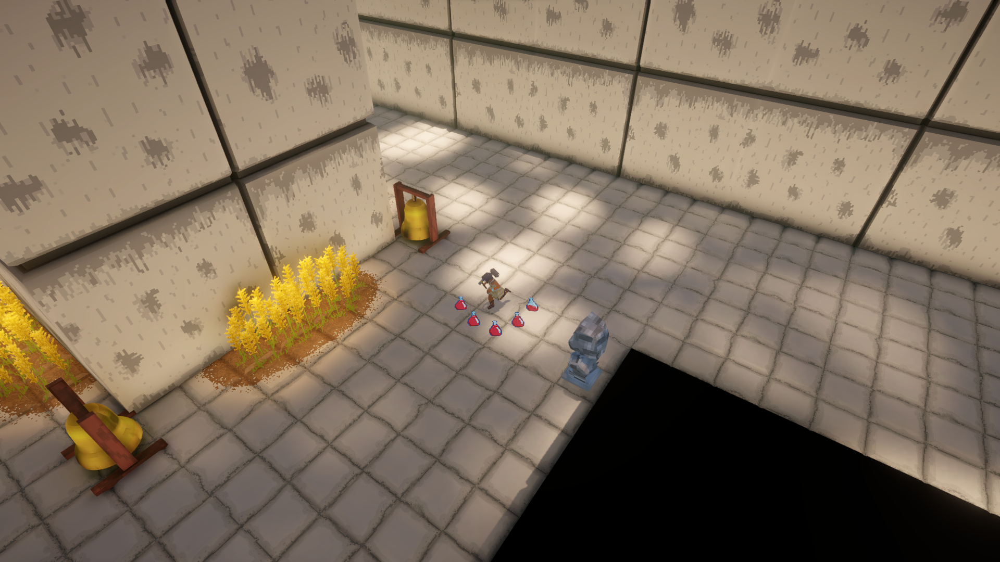

# Knossos

This is the repository for the *Knossos* game made for Rafale25 and I's Master's degree final project. It has been developped over the course of our 3rd semester in Heriot-Watt University's Games Design & Development MDes. The game itself is available on [itch.io](https://primarter.itch.io/knossos)

This game is an exploration/action game centered around discovering a maze and escaping the Minotaur within it. The player is thrust into Daedalus' maze for the annual sacrifice to the Minotaur. Upon arrival they picked up Daedalus' magic hammer, their only weapon in this hostile place. Even that weapon isn't enough to kill the Minotaur though. They can merely stagger it by unleashing the hammer's power. Regardless, it is well-known that Daedalus built an escape into that maze and they need to figure it out.

Rafale25 and I chose to draw inspiration from things that we liked such as movies or other games. He thought of the *Maze Runner* movie and how the look of the maze was really well done. From that idea, I thought of the myth of the Minotaur from the city of Knossos. Tributes (as in human sacrifice) were thrown in the maze Daedalus constructed every year to appease the deadly creature imprisoned within. Then Theseus comes along after a couple of years, kills the Minotaur and thanks to Ariadne, escapes the maze. This myth is well known in Western culture, spread by reimaginations across pop-culture. It makes for a great base for a small game as the main elements are easily recognisable.

Rafale25 found the game *Cloud Garden* and really liked its aesthetic. It was our biggest reference for visuals. We drew inspiration from that and built upon it through our crisp lighting and visual effects that contrast with the 3D pixel art of the models. We based the combat and exploration around games like *Hades* or *Death's door* but tried to make it slower paced.

The development took a bit more than 3 months. That includes designing the gameplay and all its systems, making all the assets (except the audio assets), programming everything, playtesting, bug fixing, etc. The game was made in Unity, the assets were made using Blender and Krita.

If you've got any further questions on the game, feel free to reach out at primarter@gmail.com.
